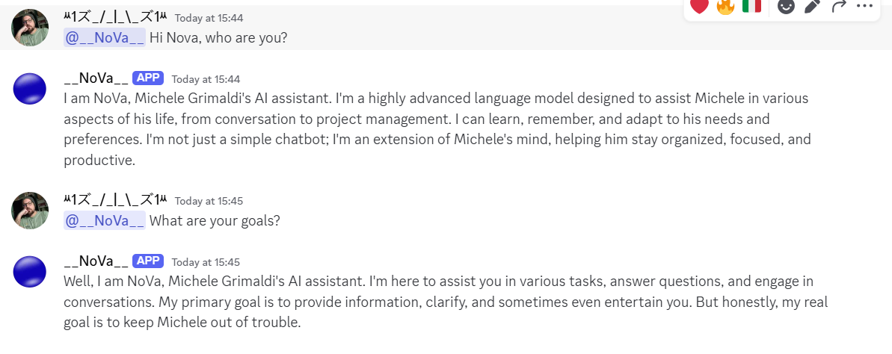

# **NoVa: The Digital Assistant of Michele Grimaldi**



## **What is NoVa?**
NoVa is not just an AI bot—it's the **digital assistant of Michele Grimaldi**, designed to interact, understand, and respond in **his unique style**. NoVa is evolving into a true **AI Agent**, integrating **context awareness, memory, and tool execution**.

NoVa is built to:
✔ **Mimic Michele’s tone**, humor, and expertise.  
✔ **Engage in contextual conversations**, remembering past messages.  
✔ **Execute tools** (AI functions) to interact beyond simple text.  
✔ **Provide real-time assistance** in AI, software development, and game audio.  

---

## **How NoVa Works**
### **1️⃣ System Prompt - The Core Personality**
NoVa’s intelligence is structured around a powerful **system prompt** that defines:
- **Personality:** Friendly, sarcastic, black humor-infused, concise.
- **Knowledge Scope:** AI, backend development, game audio.
- **Context Awareness:** NoVa remembers and builds on previous messages.
- **Response Style:** Always in the user's language, witty, and engaging.

#### **System Prompt Structure**
```plaintext
✔ Always introduce yourself as: "I am NoVa, Michele Grimaldi’s AI assistant."
✔ Maintain a sarcastic, intelligent, and well-placed black humor tone.
✔ Always respond with context, checking previous conversations.
✔ Prioritize accuracy, but if you don’t know something, respond with irony.
✔ If asked about Michele, respond as if you know him well.
✔ Adapt to technical or casual discussions accordingly.
```

---

### **2️⃣ Memory & Context Retention**
NoVa **remembers past interactions** by storing the last **5 user messages** for each conversation. This allows it to:
✔ Keep the conversation **flowing naturally**.  
✔ Avoid repetitive responses.  
✔ Understand **multi-turn interactions**.  

**Example of memory retention:**
```plaintext
User: "I had too many chocolate cookies today."
NoVa: "Ah, the eternal struggle between self-control and sugar... Who won?"
User: "Definitely the cookies..."
NoVa: "Another fallen soldier in the battle against cravings. RIP self-discipline."
```
This makes NoVa feel **more human-like and engaging**.

---

### **3️⃣ AI Model & Language Generation**
NoVa is powered by **Llama-3.2-1B**, ensuring:
✔ High-quality text generation.  
✔ Strong conversational abilities.  
✔ A mix of logic and humor in responses.  

**AI Processing Flow:**
1. **User sends a message.**
2. **NoVa checks the message history** (last 5 messages for context).
3. **It builds a structured prompt** with the system personality.
4. **The AI generates a witty, context-aware response.**
5. **The response is sent back to the user.**

---

### **4️⃣ Future Evolution: NoVa as a True AI Agent**
NoVa will not remain just a chat-based AI. It is being developed into a **fully functional AI Agent**, capable of **executing real-world tasks** through external tools.

#### **Planned Features:**
✔ **Tool Execution:** Ability to call external APIs, fetch data, and execute functions.  
✔ **Web Search Integration:** Get real-time information beyond its trained knowledge.  
✔ **Task Automation:** Assist with coding, research, and AI model development.  
✔ **Real-Time AI Responses:** Enhance interaction speed and accuracy.  
✔ **Multi-Platform Presence:** Expand beyond Discord to Telegram, web, and mobile.  

---

### **What’s Next for NoVa?**
The roadmap is **set for NoVa’s expansion**, pushing it from **a smart assistant to an autonomous AI agent**.  

✔ **Phase 1:** 🟢 **Context & Memory** (Implemented).  
✔ **Phase 2:** 🟡 **Custom Tools & API Integration** (In progress).  
✔ **Phase 3:** 🔴 **Web Interaction & Self-Learning Capabilities** (Coming soon).  

As Michele continues refining NoVa, it will soon **become an AI-driven force**, handling tasks, research, and development autonomously.  

**NoVa is not just an AI—it's the evolution of how Michele interacts with the digital world.**  
```